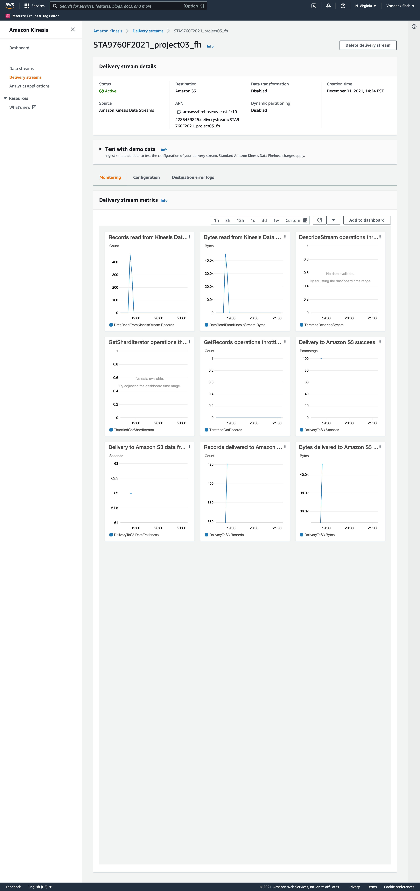
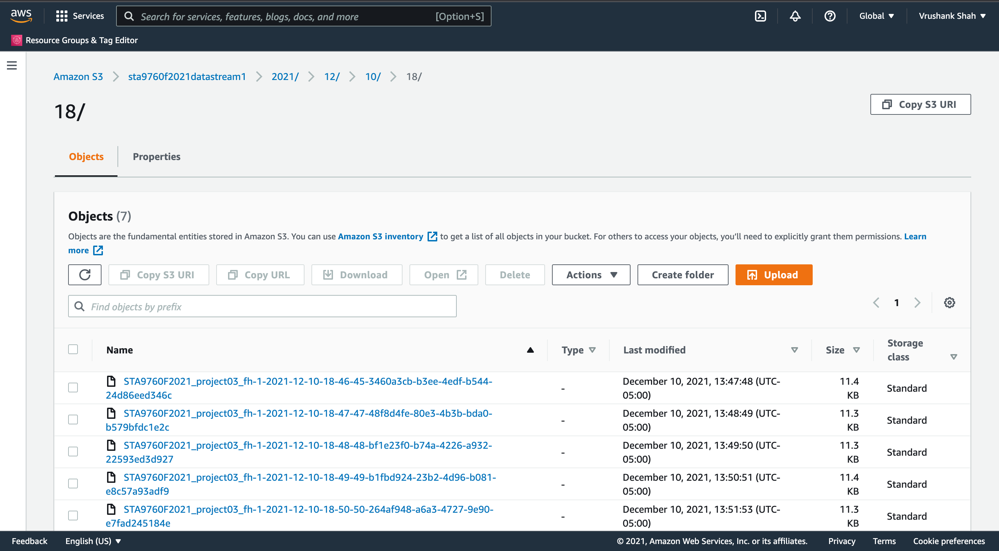

In this project, we will be streaming "real-time" data, processing the data, and dumping it into a S3 bucket that will analyzed and queried in AWS Athena.
We will be using AWS Kinesis, AWS Lambda, and the yfinance module to pull the stock information and price of the following stocks into a S3 bucket:
- Facebook (FB)
- Shopify (SHOP)
- Beyond Meat (BYND)
- Netflix (NFLX)
- Pinterest (PINS)
- Square (SQ)
- The Trade Desk (TTD)
- Okta (OKTA)
- Snap (SNAP)
- Datadog (DDOG)

Then we will be using AWS Glue to crawl through the S3 bucket and load the data into a queryable format for AWS Athena to query and analyze the data. 

#### This project consists of three infrastructure elements parts: 
#### 1. Data Transformer
#####        - We will create a Kinesis Firehose Delivery Stream which have a lambda function that transforms the records and streams it into an S3 bucket. 
#### 2. Data Collector 
#####       - We will write a lambda function to get stock price data and place it into the delivery (DataTransformer).
#### 3. Data Analyzer
#####        - We will use AWS Athena to gain insight into our streamed data.

#### Additionally, we will generates a few visualizations on Jupyter Notebook.

### Kinesis Data Firehose Delivery Stream Monitoring

### S3 Bucket
